<!-- ============ HEADER ============ -->

  

  

  
  
  
  

---

### whoami

I'm a **deep learning researcher** and **software engineer**. My research home is
**3D learning, point clouds, geometry, and representation learning on unstructured spatial
data**. I currently working at University of Western Australia and Language key Ltd.

---

### 3D point clouds

  

---

### What I'm building

**[Best Test](https://best.languagekey.com) — Real-time conversational AI English test system** 
A low-latency, full-duplex voice English examiner system, currently as a commercial project affiliated with Language Key Ltd. 

**[IoT5506](https://github.com/SeiKasahara/IoT5506) — open-source full-stack IoT platform**
The whole path: ESP32 telemetry → Django API → Postgres → React dashboard, containerized and
shipped via CI/CD. Real-time device management, Docker-first.

**[HomeBridge](https://github.com/SeiKasahara/HousingCrisisSolution) — housing-coordination platform**
Multi-role access (applicants, social workers, landlords, orgs) and workflow automation around a
real social problem. 

**[TheatrumMundi](https://theatrumundi.com) — live worldbuilding SaaS**
React + TypeScript on an ASP.NET Core 9 backend. In production, serving real users.

---

### Stack I reach for

  <b>Research / AI</b> 
   
  <b>Product / Backend</b> 
   
  <b>Infra / Data</b> 
  

---

<!-- topics + recently-starred repos + reaction breakdown — GitHub token only -->

  

<!--
  OPTIONAL personal panels (need an extra account/secret — see metrics.yml):
    - github-metrics-anime.svg   (AniList shelf — set your AniList username)
    - github-metrics-music.svg   (now-playing / top tracks — needs a music token)
  Uncomment once wired:
  

    
    
  

-->

---

### By the numbers

<!-- Generated by lowlighter/metrics — see .github/workflows/metrics.yml -->

  

  
  

<!-- 3D skyline of my contributions — on theme :) -->

  

  

---

  <a href="https://seikasahara.com/en/"><b>Personal Blog</b></a> ·
  <a href="https://x.com/KirisameCalhoun"><b>X / Twitter</b></a> ·
  <a href="https://github.com/SeiKasahara"><b>GitHub</b></a>

  

